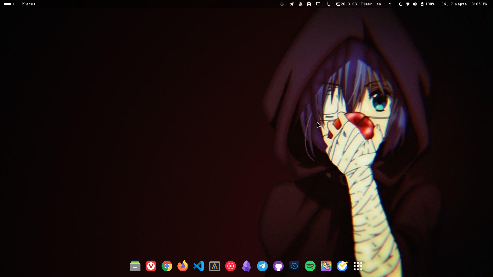
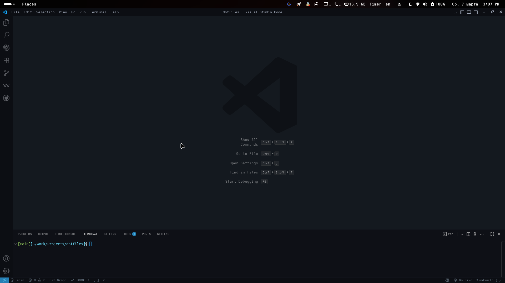
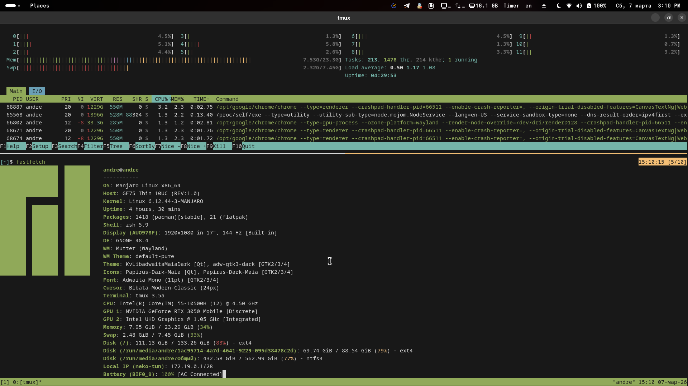
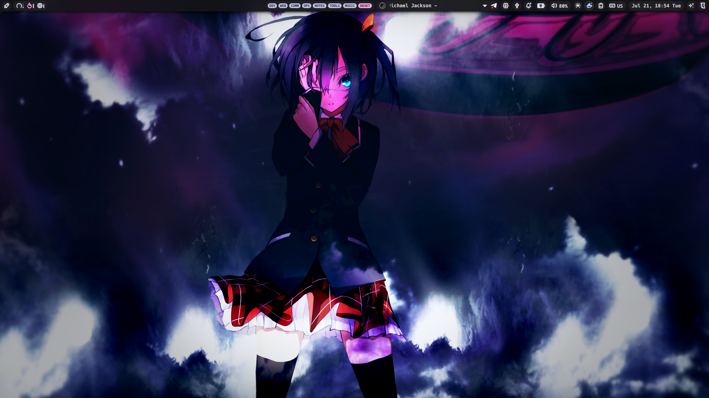
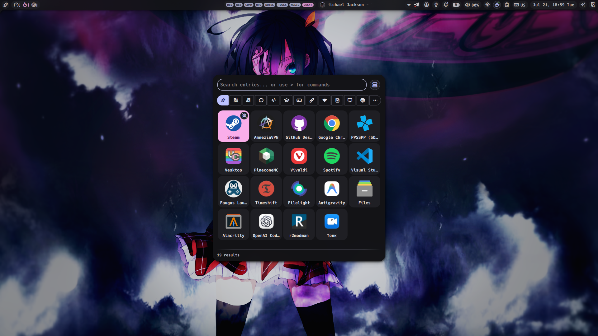
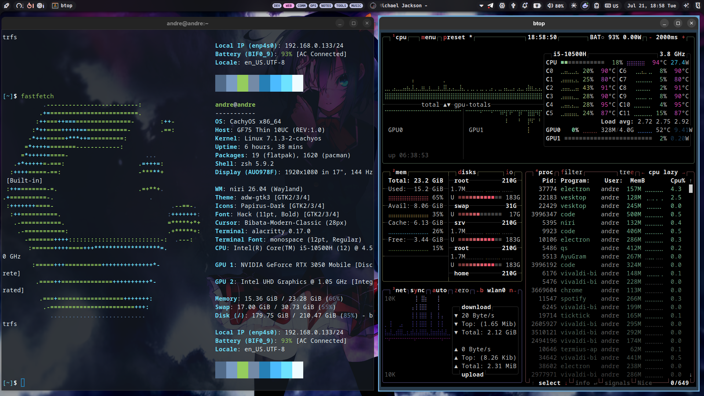

# Dotfiles

Конфиги для Arch Linux.  
Поддерживаемые окружения:

- GNOME (есть настройки и расширения)  




- Niri 




- KDE (будет позже)  

## Структура

- `/zsh` → `.zshrc`  
- `/tmux` → `.tmux.conf`, `statusline.conf`, `utility.conf`  
- `/desktop`
	- `gnome` → gsettings и список расширений  
	- `niri` → конфиги для Niri и NoctaliaShell
- `/scripts` → вспомогательные скрипты  
	- `install-gnome-extensions.sh` → устанавливает все расширения из списка

## Установка

### 1. Пакеты
```bash
git clone https://github.com/Idzu/dotfiles.git ~/.dotfiles
cd ~/.dotfiles
chmod +x ./scripts/install-packages.sh
./scripts/install-packages.sh
```

## 2. Применение конфигов
```bash
sudo pacman -S stow
cd ~/.dotfiles
stow */
```

## 2.1 GNOME
```bash
# Установить расширения
chmod +x ./scripts/install-gnome-extensions.sh
./scripts/install-gnome-extensions.sh

# Восстановить настройки
dconf load / < desktop/gnome/gsettings.conf
```

## Шпаргалки
### Сохранение установленных пакетов
```bash
# Чтобы перечислить пакеты, установленные из официальных репозиториев Arch
pacman -Qenq > pkglist.txt
# Чтобы перечислить пакеты, установленные из AUR или сторонних репозиториев:
pacman -Qmq > aurlist.txt
```
### Фикс бага с f-ками на внешнем клавиатуре

Для клавиатур, определяющихся как Apple,  
включается режим F-клавиш по умолчанию из-за чего F11/F12 работают как громкость.

#### Применение

```bash
chmod +x ./scripts/setup-keyboards.sh
./scripts/setup-keyboards.sh
sudo reboot
```

### GNOME
```bash
# Сохранить список расширений
gnome-extensions list > desktop/gnome/extensions.txt
# Сохранить список активных расширений
gsettings get org.gnome.shell enabled-extensions > desktop/gnome/enabled-extensions.txt
# Сохранить все настройки
dconf dump / > desktop/gnome/gsettings.conf
```

## 2.2 Niri + Noctalia Shell

```bash
mkdir -p ~/.config/niri ~/.config/noctalia

cp desktop/niri/config.kdl ~/.config/niri/
cp -r desktop/niri/noctalia/* ~/.config/noctalia/
```

Перезапустить Niri:

```bash
niri msg action quit
```

или просто выйти из сессии и войти снова.

Если Noctalia Shell не обновилась автоматически:

```bash
qs -c ~/.config/noctalia
```

## TODO
- Добавить конфиг для KDE